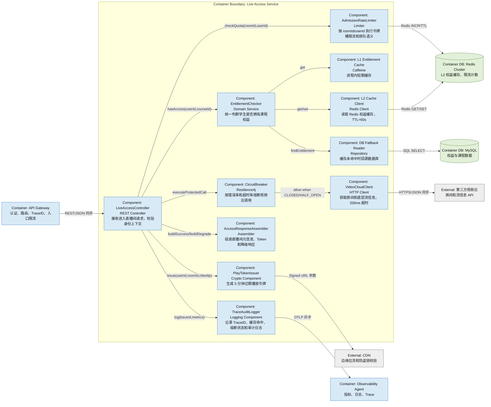

# Component_View

## 1. 视图说明

- **视图编号**: View-003、View-004
- **C4 层级**: C4 Level 3 - Component
- **目标**: 展开至少 2 个高风险/核心容器，说明组件职责、接口和依赖关系。
- **展开容器**:
  - Live Access Service: 直播入口洪峰、视频云抖动、防盗链令牌都集中在该容器。
  - Order Service + Entitlement Service: 支付回调重复、延迟和权益发放一致性集中在该链路。

## 2. View-003: Live Access Service 组件图

### Live Access Service 组件说明

| 组件 | 职责 | 接口 | 依赖关系 |
|---|---|---|---|
| LiveAccessController | 编排进入直播间请求，返回成功、排队或 429 响应 | `GET /live/{roomId}/access` | AdmissionRateLimiter、EntitlementChecker、CircuitBreaker、PlayTokenIssuer |
| AdmissionRateLimiter | 按房间和用户限流，保护入口服务 | `checkQuota(roomId,userId)` | Redis |
| EntitlementChecker | 统一进行课程权益判断 | `hasAccess(userId,courseId)` | L1 Cache、L2 Cache Client、DB Fallback Reader |
| L1 Entitlement Cache | 进程内短期缓存，降低 Redis 压力 | `get/set` | Caffeine |
| L2 Cache Client | 读取 Redis 权益缓存，TTL=60s | `get/set entitlement` | Redis Cluster |
| DB Fallback Reader | 双层缓存未命中时回源数据库 | `findEntitlement` | MySQL |
| CircuitBreaker | 对视频云 API 做超时、熔断、半开恢复 | `executeProtectedCall` | VideoCloudClient |
| VideoCloudClient | 调用第三方视频云获取房间和流信息 | `getRoomStream(roomId)` | 第三方视频云 |
| PlayTokenIssuer | 生成短期播放令牌，绑定用户、课程、IP、TTL | `issue(userId,roomId,clientIp)` | 对称密钥、CDN 防盗链规则 |
| AccessResponseAssembler | 组装直播间元信息、播放 URL 和降级提示 | `buildSuccess/buildDegrade` | PlayTokenIssuer |
| TraceAuditLogger | 记录 TraceID、缓存命中、熔断状态和审计日志 | `log(traceId,metrics)` | Observability Agent |

## 3. View-004: 支付回调与权益发放组件图

```mermaid
flowchart LR
    pay["External: 第三方支付平台<br/>异步回调，至少一次投递"]
    mq[("Container Queue: Message Queue<br/>OrderPaidEvent")]
    orderDb[("Container DB: Order DB<br/>订单、支付流水、幂等键")]
    entitlementDb[("Container DB: Entitlement DB<br/>用户课程权益")]
    redis[("Container DB: Redis<br/>权益缓存")]
    otel["Container: Observability Agent<br/>TraceID 与审计日志"]

    subgraph order["Container Boundary: Order Service"]
        callback["Component: PaymentCallbackController<br/>REST Controller<br/>接收支付回调并快速响应"]
        verifier["Component: CallbackSignatureVerifier<br/>Security Component<br/>校验签名、时间戳和来源"]
        idempotency["Component: PaymentIdempotencyGuard<br/>Domain Service<br/>基于 paymentOrderId 唯一键防重"]
        stateMachine["Component: OrderStateMachine<br/>Domain Component<br/>保证订单状态单向合法跃迁"]
        publisher["Component: OrderPaidEventPublisher<br/>MQ Producer<br/>可靠发布支付成功事件"]
        reconcile["Component: ReconciliationJob<br/>CronJob<br/>扫描已支付但权益未生效订单并补偿"]
    end

    subgraph ent["Container Boundary: Entitlement Service"]
        consumer["Component: OrderPaidEventConsumer<br/>MQ Consumer<br/>消费支付成功事件"]
        grantGuard["Component: EntitlementGrantGuard<br/>Domain Service<br/>基于 userId+courseId 二次幂等"]
        grant["Component: EntitlementGrantService<br/>Domain Service<br/>发放课程权益"]
        cache["Component: EntitlementCacheInvalidator<br/>Cache Client<br/>刷新或删除权益缓存"]
    end

    pay -->|"HTTPS Webhook JSON/XML 异步"| callback
    callback -->|"verify(payload,signature)"| verifier
    callback -->|"tryAcquire(paymentOrderId)"| idempotency
    idempotency -->|"SQL INSERT UNIQUE"| orderDb
    callback -->|"markPaid(orderId)"| stateMachine
    stateMachine -->|"SQL UPDATE"| orderDb
    stateMachine -->|"create event"| publisher
    publisher -->|"MQ/JSON Schema 异步"| mq
    mq -->|"MQ/JSON Schema 异步"| consumer
    consumer -->|"tryGrant(userId,courseId)"| grantGuard
    grantGuard -->|"SQL SELECT/INSERT UNIQUE"| entitlementDb
    grantGuard -->|"grant(event)"| grant
    grant -->|"SQL INSERT entitlement"| entitlementDb
    grant -->|"invalidate(userId,courseId)"| cache
    cache -->|"Redis DEL/SET"| redis
    reconcile -->|"SQL scan abnormal orders"| orderDb
    reconcile -->|"MQ compensation event"| mq
    callback -->|"OTLP/audit 异步"| otel
    consumer -->|"OTLP/audit 异步"| otel

    classDef component fill:#d9eaf7,stroke:#2f75b5,color:#111;
    classDef datastore fill:#e2f0d9,stroke:#548235,color:#111;
    classDef external fill:#eeeeee,stroke:#666,color:#111;
    class callback,verifier,idempotency,stateMachine,publisher,reconcile,consumer,grantGuard,grant,cache,otel component;
    class mq,orderDb,entitlementDb,redis datastore;
    class pay external;
```

### 支付与权益组件说明

| 组件 | 职责 | 接口 | 依赖关系 |
|---|---|---|---|
| PaymentCallbackController | 接收支付回调，执行验签、幂等、状态推进并快速返回 HTTP 200 | `POST /payment/callback` | Verifier、IdempotencyGuard、OrderStateMachine |
| CallbackSignatureVerifier | 校验签名、时间戳和回调来源 | `verify(payload,signature)` | 支付平台公钥/密钥 |
| PaymentIdempotencyGuard | 使用 `paymentOrderId` 唯一键拦截重复回调 | `tryAcquire(paymentOrderId)` | Order DB |
| OrderStateMachine | 保证订单只进行合法状态迁移 | `markPaid(orderId)` | Order DB |
| OrderPaidEventPublisher | 发布带 TraceID 的支付成功事件 | MQ Producer | Message Queue |
| ReconciliationJob | 定时扫描异常订单并补偿重发事件 | CronJob | Order DB、Message Queue |
| OrderPaidEventConsumer | 消费支付成功事件 | MQ Consumer | Message Queue |
| EntitlementGrantGuard | 使用 `userId + courseId` 做权益侧二次幂等 | `tryGrant(userId,courseId)` | Entitlement DB |
| EntitlementGrantService | 发放课程权益 | `grant(event)` | Entitlement DB |
| EntitlementCacheInvalidator | 刷新或删除权益缓存 | `invalidate(userId,courseId)` | Redis |
