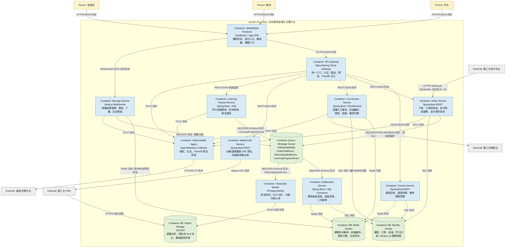

# Container_View

## 1. 视图说明

- **视图编号**: View-002
- **C4 层级**: C4 Level 2 - Container
- **目标**: 展示系统内部主要容器、技术选型、职责、接口和通信方式。

## 2. C4 Level 2 容器图

## 3. 容器说明

| 容器 | 技术选型 | 职责 | 对外暴露接口 |
|---|---|---|---|
| Web/Mobile Frontend | Vue/React + App SDK | 用户界面、播放器、支付入口、弹幕入口 | HTTPS 页面/API 调用、WebSocket 客户端 |
| API Gateway | Nginx/Spring Cloud Gateway | 统一入口、认证、路由、限流、TraceID 注入 | `/api/**`, `/live/**`, `/media/**` |
| Course Service | Spring Boot REST | 课程目录、课程详情、教师课程管理 | `GET /courses`, `GET /courses/{id}`, `POST /teacher/courses` |
| Order Service | Spring Boot REST | 下单、订单状态机、支付回调幂等、发布支付事件 | `POST /orders`, `GET /orders/{id}`, `POST /payment/callback` |
| Entitlement Service | Spring Boot + MQ Consumer | 课程权益发放、权益查询、事件消费二次幂等 | `GET /entitlements/check`, MQ Consumer |
| Live Access Service | Spring Boot + Resilience4j | 直播入口鉴权、L1/L2 权益缓存、限流、熔断、播放令牌签发 | `GET /live/{roomId}/access` |
| Media Auth Service | Spring Boot REST | 点播/直播 URL 签名、TTL 与 IP 绑定、防盗链参数生成 | `POST /media/play-url` |
| Barrage Service | Node.js WebSocket | 弹幕连接、限流、广播、互动功能降级 | `WS /ws/barrage/{roomId}` |
| Learning Record Service | Spring Boot + MQ | 学习进度上报接收、异步削峰、聚合落库 | `POST /learning/progress` |
| Transcode Worker | FFmpeg Worker | 视频转码、HLS 切片、任务 ACK 和失败重投递 | MQ Consumer |
| MySQL Cluster | MySQL/RDS | 课程、订单、权益、学习记录等业务数据 | SQL |
| Redis Cluster | Redis | 热点课程缓存、权益缓存、限流计数、互动状态 | Redis API |
| Message Queue | Kafka/RabbitMQ | 事件削峰、异步解耦、可靠投递 | MQ Topic/Queue |
| Object Storage | OSS/S3 | 录播文件、HLS 切片、静态媒体资源 | S3 API/HTTPS |
| Observability Agent | OpenTelemetry Collector | 日志、指标、链路追踪聚合转发 | OTLP |

## 4. 容器间通信说明

| 来源 | 目标 | 协议 | 数据格式 | 同步/异步 | 说明 |
|---|---|---|---|---|---|
| Frontend | API Gateway | HTTPS | JSON | 同步 | 用户可感知业务请求入口。 |
| Frontend | Barrage Service | WebSocket | JSON | 异步双向 | 弹幕和互动消息，不阻塞直播拉流。 |
| API Gateway | Course/Order/Live/Media | REST | JSON | 同步 | 业务 API 调用。 |
| API Gateway | Learning Record Service | REST | JSON | 同步快速返回 | 接收学习进度后写入 MQ，避免同步落库。 |
| Payment Platform | Order Service | HTTPS Webhook | JSON/XML | 异步至少一次 | 需要订单侧幂等拦截。 |
| Order Service | MQ | MQ | JSON Schema | 异步 | 发布支付成功事件，解耦权益发放。 |
| MQ | Entitlement Service | MQ | JSON Schema | 异步 | 消费支付成功事件并发放权益。 |
| Live Access Service | Video Cloud | HTTPS API | JSON | 同步 | 外部依赖调用必须有超时和熔断。 |
| Media Auth Service | CDN | Signed URL | URL 参数 | 同步 | CDN 边缘节点基于签名参数校验。 |
| Services | Observability Agent | OTLP | JSON/Protobuf | 异步 | 全链路透传 TraceID。 |
