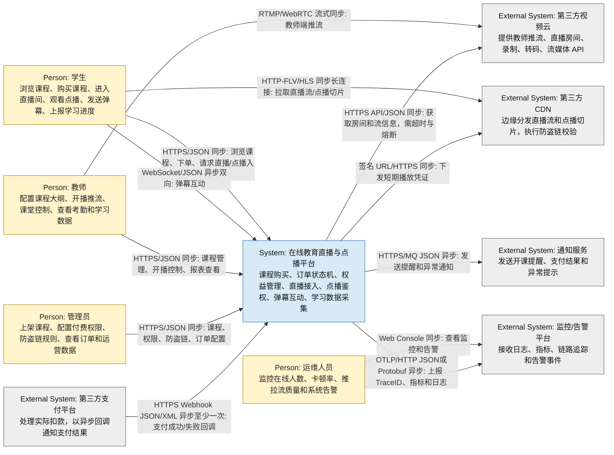

# Context_View

## 1. 视图说明

- **视图编号**: View-001
- **C4 层级**: C4 Level 1 - System Context
- **目标**: 标明用户角色、外部系统、系统边界及交互关系。

## 2. C4 Level 1 系统上下文图

## 3. 关系说明

| 关系 | 协议 | 数据格式 | 同步/异步 | 说明 |
|---|---|---|---|---|
| 学生 -> 平台 | HTTPS | JSON | 同步 | 浏览课程、下单、查询权益、请求直播或点播入口。 |
| 学生 -> 平台 | WebSocket | JSON | 异步双向 | 弹幕和互动消息，不阻塞视频播放主链路。 |
| 学生 -> CDN | HTTP-FLV/HLS | 流媒体切片/长连接 | 同步长连接 | 学生直接从 CDN 边缘节点拉流，降低中心平台出口带宽压力。 |
| 教师 -> 平台 | HTTPS | JSON | 同步 | 课程配置、开播控制、课堂管理和报表查询。 |
| 教师 -> 视频云 | RTMP/WebRTC | 流媒体 | 同步长连接 | 教师推流进入第三方视频云，平台不实现底层推流网络。 |
| 管理员 -> 平台 | HTTPS | JSON | 同步 | 配置课程权限、防盗链规则、订单和运营数据。 |
| 支付平台 -> 平台 | HTTPS Webhook | JSON/XML | 异步至少一次 | 回调可能重复或延迟，订单服务必须幂等处理。 |
| 平台 -> 视频云 | HTTPS API | JSON | 同步 | 获取直播房间、流地址和转码状态；需要超时、熔断和降级。 |
| 平台 -> CDN | Signed URL/HTTPS | URL 参数 | 同步 | 下发短期播放 URL，CDN 边缘节点校验防盗链。 |
| 平台 -> 通知服务 | HTTPS/MQ | JSON | 异步 | 非核心通知不应阻塞支付、直播和点播链路。 |
| 平台 -> 监控平台 | OTLP/HTTP | JSON/Protobuf | 异步 | 上报 TraceID、日志、指标和告警，支撑故障定位。 |

## 4. 系统边界声明

**范围内**:

- 课程购买、订单状态机、支付回调幂等。
- 课程权益管理、直播进入鉴权、点播防盗链鉴权。
- 弹幕互动、学习进度采集、异步转码任务调度。
- 缓存、消息队列、审计日志和可观测性。

**范围外**:

- 第三方支付平台的实际扣款。
- 第三方视频云的底层推流、拉流、录制和转码基础设施。
- CDN 边缘节点的物理运营和网络调度。
- 通知服务的底层短信/站内信投递通道。
