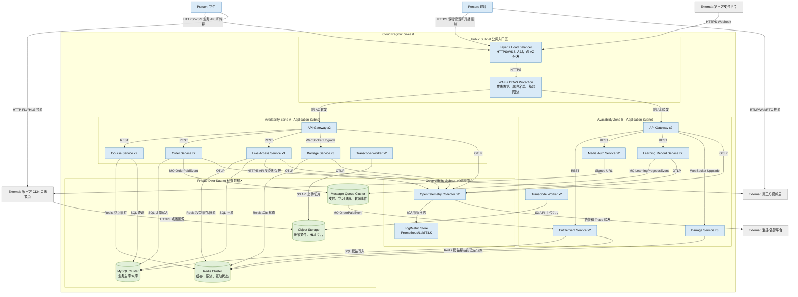

# Deployment_View

## 1. 视图说明

- **视图编号**: View-009
- **视图类型**: C4 Deployment View
- **目标**: 从云原生视角说明生产环境部署拓扑、Region/AZ、网络分区、负载均衡、存储层和高可用策略。

## 2. 生产环境部署拓扑图

## 3. 网络分区

| 分区 | 部署内容 | 访问控制 |
|---|---|---|
| Public Subnet | Load Balancer、WAF、DDoS Protection | 对公网开放 HTTPS/WSS，只转发到 API Gateway |
| Application Subnet | API Gateway、业务服务、弹幕服务、Worker | 不直接暴露公网；允许服务间白名单通信和必要外部 API 出站 |
| Private Data Subnet | MySQL、Redis、MQ、Object Storage 私有访问入口 | 不对公网开放，只允许应用子网访问 |
| Observability Subnet | OTel Collector、日志指标存储 | 接收应用遥测，运维通过受控入口访问 |

## 4. 高可用策略

| 策略 | 说明 | 对应质量属性 |
|---|---|---|
| 跨 AZ 多副本部署 | API Gateway、Live Access、Barrage、Learning 等服务至少跨两个可用区部署 | 可用性、可伸缩性 |
| 负载均衡健康检查 | LB 只将流量转发到健康实例，异常实例自动摘除 | 可用性 |
| CDN 边缘分发 | 学生拉流直接访问 CDN，中心系统只负责签名和鉴权 | 性能、可伸缩性 |
| MySQL 主从 | 主库承载写入，从库承接低优先级查询和报表 | 性能、可用性 |
| Redis/MQ 集群 | 缓存、限流、异步事件具备集群冗余 | 可用性 |
| 熔断降级 | 第三方视频云异常时 Live Access 快速失败或返回排队提示 | 可用性 |
| 滚动发布 | 互动服务等模块通过 rolling update 发布 | 可修改性 |
| TraceID 全链路追踪 | API 和 MQ 事件统一透传 TraceID | 可观测性 |

## 5. 降级策略

- 视频云 API 抖动时，Live Access Service 返回 429 或“正在排队中”，不阻塞已在直播间内的拉流用户。
- Barrage Service 异常时，前端降级为“可观看、不可互动”，视频播放主链路继续可用。
- Redis 故障时，Course Service 和 Live Access Service 限流回源，避免数据库被瞬时打满。
- MQ 积压时，支付权益和学习进度进入最终一致窗口，通过消费者恢复和对账任务补偿。
