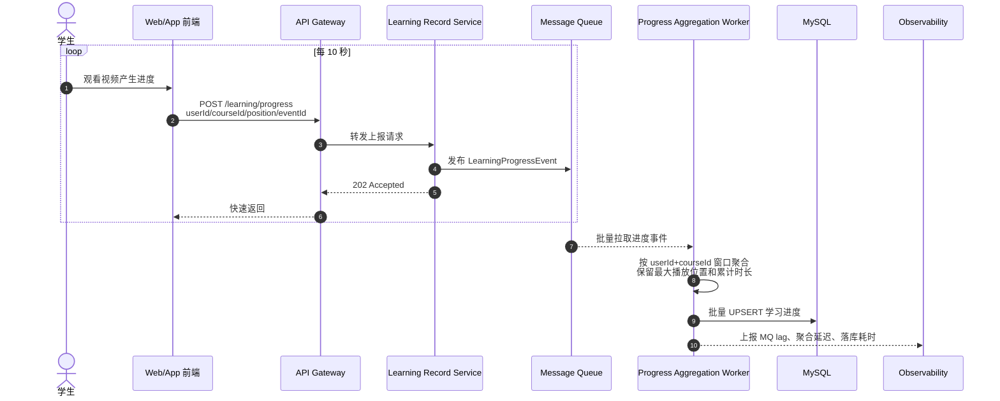

# Dynamic_Views

## 1. View-008: 学习进度上报异步削峰

- **关联 QAS**: QAS-008
- **关联 ADR**: 原文档未单独设置 ADR，本视图依据 QAS-008 和容器图补充运行时说明。

### 2.时序说明

学习进度入口服务不直接同步写数据库，而是将事件写入 MQ 后快速返回。后台 Worker 按用户和课程维度做短窗口聚合，再批量落库，从而把高频小写转换成低频批量写。

### 3.质量属性响应分析

- **性能**: 上报 API 可在 100ms 内快速返回。
- **可伸缩性**: MQ 提供削峰能力，Worker 可水平扩容。
- **一致性权衡**: 学习进度存在短暂最终一致延迟，通常控制在 30 秒内。
